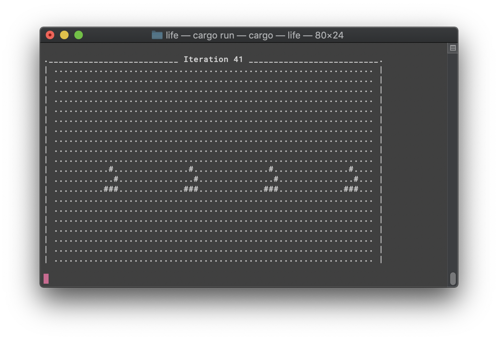

# RustyLife
## Game of Life implementation in Rust

Simple implementation to learn the basics of Rust, by default will spawn 4 'glider' patterns on an infinitely looping, torus shaped grid.

Screenshot showing live cells as ```#``` and dead cells as ```.```:


